# 个人工作总结

## 一、工作内容概述
在本次项目开发中，我全面负责了游戏从核心玩法循环到最终结局呈现的多个关键环节，不仅完成了功能实现，也深度参与了系统架构与交互体验的设计。我的工作旨在构建一个集侦探解谜、剧情推进和沉浸式体验于一体的完整游戏世界。

### 1. 核心系统架构与实现
我主导设计并开发了支撑整个游戏运行的核心系统，确保了游戏玩法的逻辑严谨性和可扩展性。

#### 侦探交互系统
- **尸体交互逻辑**：设计了尸体的部分交互系统，玩家可以进入卧室看到尸体，与尸体进行互动。
    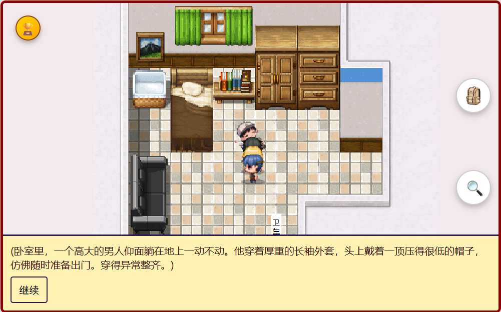  
- **条件性解锁**：为交互系统加入前置条件判断。例如，在对 NPC 进行初步盘问之前，搜身选项是锁定状态，这种设计确保了游戏流程的合理性。
    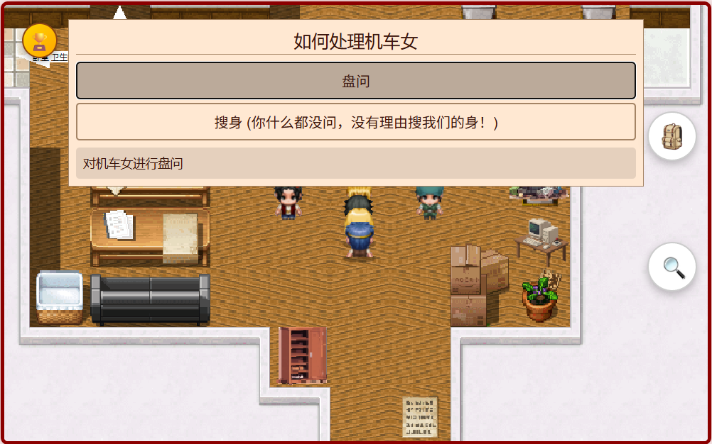

#### 指认与结局系统
- **模块化设计**：最终的指认环节被封装成 `ZhirenManager` 模块，包含从选择嫌疑人、回答证据链问题到最终判定结局的全部功能。
    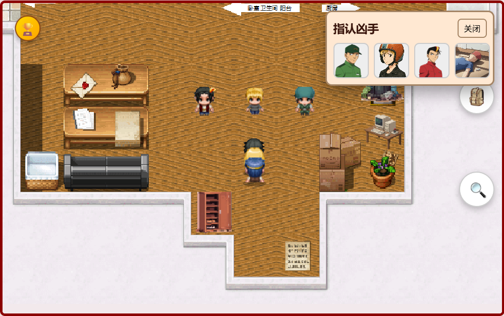
    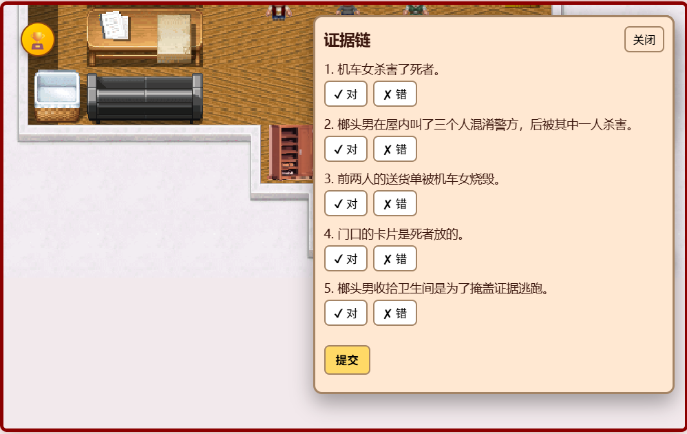
    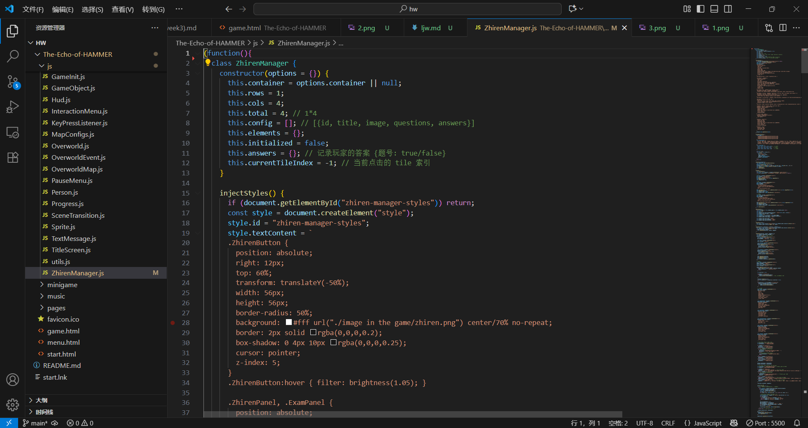
- **多结局分支**：根据玩家对证据链问题的回答是否完全正确，导向唯一的真结局或多个失败结局页面，构成核心玩法闭环。

#### 剧情与状态管理
- **事件驱动流程**：通过在 `OverworldMap` 中监听玩家行为，触发 `MapConfigs` 中预设的剧情事件。
- **动态故事标记**：利用 `playerState.storyFlags` 变量记录探索进度和关键决策，使得对话和交互会根据玩家行为动态变化。
    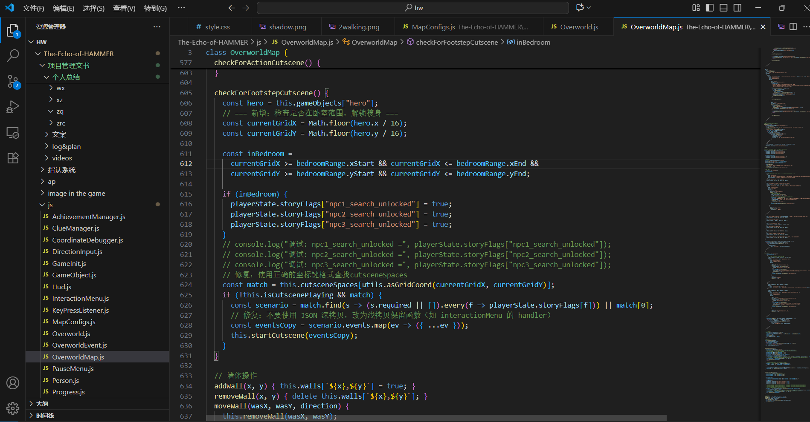

### 2. 玩法与界面实现
我将核心系统与前端界面及独立玩法结合，构建了完整的玩家体验。

#### 多层级 UI 设计与开发
- **主流程界面**：独立制作启动、读档、个人主页等主流程界面。 
    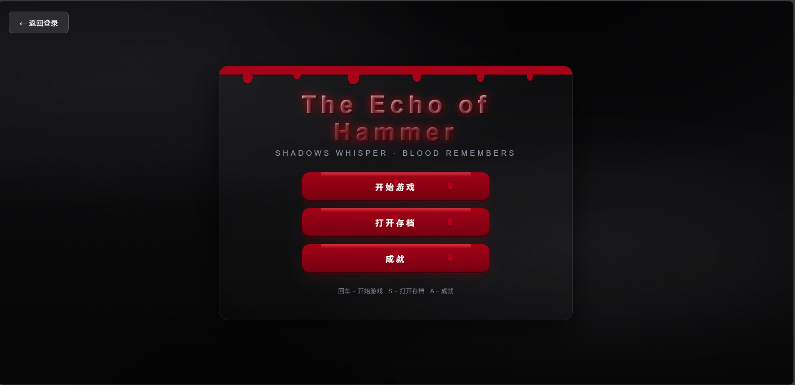 
- **创意成就界面**：设计并开发了具有 3D 翻书效果的成就册 (`achievement.html`)，代替传统列表展示。
    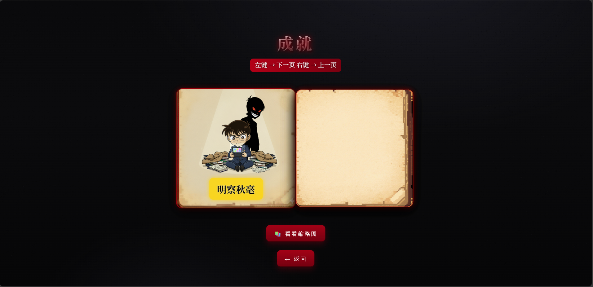
- **游戏内嵌 UI**：实现即时触发的成就解锁弹窗和常驻的指认系统按钮。
    

#### 独立玩法模块
- **Canvas 物理小游戏**：使用原生 Canvas API 制作平台跳跃跑酷小游戏 (`game.js`)，包含重力、碰撞、蹬墙跳、动态镜头跟随及“一键通关”机制。
    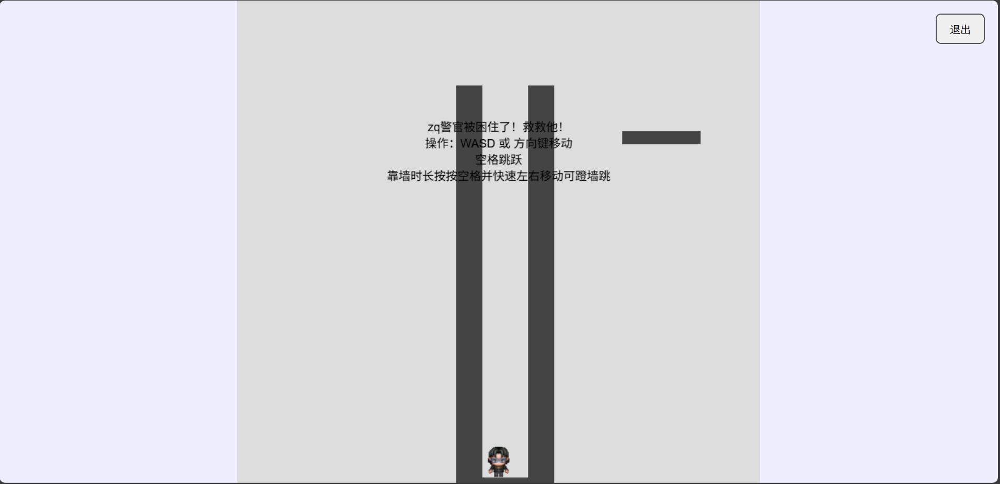
- **定制化结局画面**：为每一个错误的指认选项设计专属结局页面。
    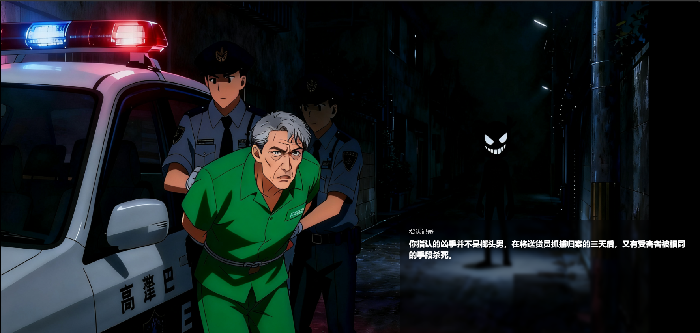

#### 沉浸式体验增强
- **背景音乐集成**：为游戏加入 BGM，增强悬疑氛围。  
    
- **成就感驱动**：实现成就系统 (`AchievementManager.js`)，在关键剧情节点给予即时反馈。
    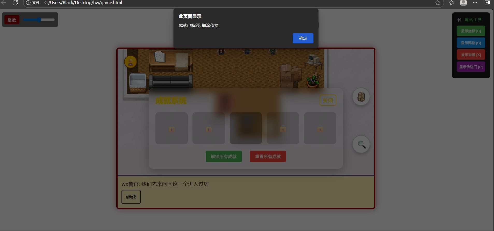
---

## 二、技术栈与架构
- **前端技术**：HTML5, CSS3, JavaScript (ES6+)  
- **游戏引擎**：基于原生 JavaScript 构建事件驱动的 2D RPG 引擎  
- **渲染核心**：HTML5 Canvas 2D API  
- **数据持久化**：`localStorage` 本地存储  
- **架构设计**：数据与逻辑分离。地图配置、NPC 信息、事件触发均在 `MapConfigs.js` 中定义，逻辑在 `Overworld.js`、`OverworldMap.js` 中实现。

---

## 三、技术亮点与实现细节

### 1. 事件驱动的异步剧情流程控制
- **实现方式**：在 `OverworldEvent.js` 中将事件封装为返回 Promise 的方法，在 `OverworldMap.js` 的 `startCutscene` 中通过 `async/await` 顺序编排。  
- **技术亮点**：  
  - 高度解耦，剧情编排只需定义事件数组。  
  - 避免回调地狱，保证连续事件的精准执行。

### 2. 数据驱动的模块化交互系统
- **实现方式**：在 `MapConfigs.js` 中通过 `cutsceneSpaces`、`interactionRange` 绑定事件，在 `OverworldMap.js` 中实时检测触发。  
- **技术亮点**：  
  - 条件性触发：支持 `required` 字段，基于 `playerState.storyFlags` 控制。  
  - 可扩展性强：新增交互仅需在配置文件中增加 JSON 数据。

### 3. 插件化核心玩法模块
- **成就系统 (`AchievementManager.js`) 与指认系统 (`ZhirenManager.js`)**  
- **实现方式**：模块为独立类，UI 自动注入，内部封装全部逻辑与数据处理。  
- **技术亮点**：  
  - 即插即用，可轻松移植。  
  - 模块内部状态自洽，解耦程度高。

### 4. 基于原生 Canvas 的物理小游戏
- **实现方式**：逐帧更新坐标与速度，包含重力、平台碰撞、蹬墙跳等机制。  
- **技术亮点**：  
  - 精细碰撞处理，判断碰撞方向实现平滑动作。  
  - 动态镜头跟随保证玩家处于视野中心。  
  - 一键通关机制避免玩家因卡关流失。

### 5. 纯 CSS 实现的 3D 翻书效果 UI
- **实现方式**：使用 `transform-style: preserve-3d`、`perspective` 创建 3D 容器，`rotateY`+`transition` 实现翻页，JS 动态切换 `.flipped` 类控制动作。  
- **技术亮点**：  
  - 性能优异：利用 GPU 加速，动画流畅。  
  - 沉浸式体验：成就界面化为“侦探手册”，增强艺术感和代入感。

---

## 四、关键 Bug 修复与用户体验优化

### 优化角色朝向更新逻辑
- **问题**：角色朝向更新与移动耦合，导致阻挡时无法立即转向。  
- **解决方案**：将朝向更新逻辑前置，优先响应按键输入，提升即时反馈，防止玩家因为方向问题无法交互。

### 完善界面导航与流程闭环
- **问题**：部分独立界面缺少返回路径，玩家可能卡死。  
- **解决方案**：在 `achievement.html`、`game.js` 等界面添加返回按钮，保证流程闭环。

---

## 五、总结

通过本次项目，我不仅独立完成了多个核心功能模块的开发，还在游戏引擎架构、异步流程控制和 UI 创新等方面进行了深入实践。整个过程让我在以下几个方面收获颇丰：

### 1. 技术能力的提升
- **系统架构思维**：通过设计模块化、数据驱动的游戏引擎架构，我更加深刻地理解了“高内聚、低耦合”的软件设计思想。
- **异步编程与流程控制**：在实现基于 `Promise` 和 `async/await` 的事件队列时，我提升了对异步编程的掌握程度，学会了如何利用事件驱动机制来保持逻辑清晰。
- **Canvas 与 CSS 高级应用**：从零实现 Canvas 物理引擎、用纯 CSS 制作 3D 翻书效果，这些过程让我对前端技术的边界有了更深刻的认识，也培养了我探索和解决新问题的能力。

### 2. 产品与用户体验思维
- **沉浸式体验设计**：通过背景音乐、成就系统、独立小游戏等功能的设计与实现，我认识到技术不仅是功能实现的工具，更是营造氛围、提升用户沉浸感的重要手段。
- **可玩性与容错性**：例如“一键通关”机制和独立结局页面，这些设计让我更关注玩家心理与行为习惯，学会在机制设计时考虑玩家的耐心、挫败感和成就感。
- **交互细节优化**：角色朝向逻辑优化、界面闭环设计，这些看似小的改动，却大幅提升了游戏的顺畅度和玩家的操作体验。

### 3. 工程与协作能力
- **模块化与可扩展性**：将成就系统和指认系统设计成独立插件，使我体会到“可移植性”和“可维护性”的重要性。未来在团队开发中，这种思想能显著降低沟通与协作成本。
- **配置驱动开发**：通过 `MapConfigs.js` 驱动事件和交互逻辑，大大提高了协作效率。

---

总体而言，本次项目让我掌握了大量前端与游戏开发相关的技能。这些收获将成为我未来继续学习和实践的坚实基础。

