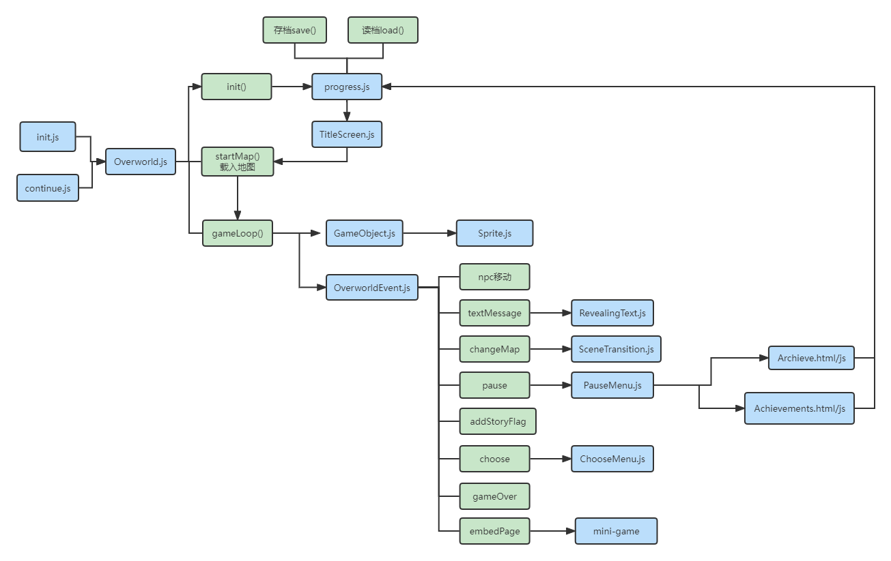

<a name="2eb9ca83"></a>
## 关于本文档
本文档主要对Second Sight游戏中的技术实现细节进行说明，假想的读者为下一届的学弟学妹们，希望能为你们的游戏设计实现提供参考。（如果不是因为太卷不给后来者留活路而被骂的话jpg）<br />需要提前说明的是，本文档主要写作者语文能力堪忧，因此如果文档内容词不达意、语句不通，还请谅解~
<a name="950cacdc"></a>
### 食用方法
由于本文档用markdown编写，难以直接链接跳转到游戏实现代码中的特定位置，所以建议读者善用f12和vscode的search功能手动跳转，一边阅读本文档一边阅读代码。

<a name="475f6788"></a>
## html文件
游戏实现代码中主要的html仅有

- index.html 
   - 根目录下的index.html是整个游戏的入口，整个游戏都在它的`iframe`中运行，这个设计其实是开发末期加的，为了实现最后一个功能——autoplay且跨页面的音乐播放。关于该功能详见`autoplay且跨页面的音乐播放`章节。
- login.html 
   - 顾名思义，实现登入、注册功能。
- game.html 
   - 游戏主体代码。
- continue.html 
   - 和game.html几乎一样，是为了继续游戏时跳过标题页而写的。
- 小组介绍页面的html文件、mini-game的html文件

上面列表中提到的功能和html文件中的代码后文中会有详细说明。

<a name="49449221"></a>
## 游戏主体概要
**Second Sight主要实现了这些功能：**

1. 基础功能：人物移动、帧动画、相机跟随人物移动、碰撞检测、npc对话
1. 选择功能、TitleMenu、PauseMenu、mini-game或者过场动画的嵌入功能
1. 登入注册功能、存档系统、跨页面自响应背景音乐、成就系统

玩家登入之后，页面跳转到`game.html`并逐步载入js文件，直到载入`init.js`后启动游戏。<br />（需要注意的是，载入js文件的顺序不能轻易改变，因为它们之前存在依赖关系，就好比不能在定义一个变量之前使用这个变量。）<br />载入`init.js`后的代码运行逻辑大致如下图所示。



<a name="0eef3278"></a>
## 常用写法说明
游戏实现中各class的constructor的传入参数常为一个config对象，这样就可以方便地添加参数。类似
```javascript
const forbidTitleScreen = config.forbidTitleScreen || false;
```
的写法则是在传入的config不含有`forbidTitleScreen`时默认其为`false`。

<a name="972db0ef"></a>
## autoplay且跨页面的音乐播放
音乐播放功能是最后实现的功能，因此为了尽量减少对前期代码的改动而在功能上有所妥协，如无法在玩家进入某个房间后更换bgm。这也算是一个教训，有些功能在前期没有考虑到，后期就不方便添加了。

由于未使用vue router路由或者其它框架，因此切换页面的时候音乐播放会中断，这在实现的时候让我挺头疼的。最终采用的方案是，把整个游戏装在一个`iframe`里，音乐在`iframe`外面播放，因此`index.html`里的`iframe`的id才会是`music-wrapper`。

右下角的音乐播放器的实现很常见没有什么好说的，有需要可以自行网络搜索“js 音乐播放器”、“js music player”等关键词。

自动播放功能，则是在`index.html`中放了一个`<div class="auto-play-music"></div>`并在css中设置它覆盖整个页面，然后给它加了一个eventListener。
<a name="44c2d65b"></a>
## 人物移动功能
主要通过`Person.js` `DirectionInput.js`实现，`Overworld.js`中的每次GameLoop都会调用`Person.js`的`update`方法：
```javascript
Object.values(this.map.gameObjects).forEach(object => {
    object.update({
        arrow: this.directionInput.direction,
        map: this.map,
    })
})
```

<a name="DirectionInput.js"></a>
### DirectionInput.js
之所以用一个列表来装玩家“按住”的按键，而不是监听`w键`被按下了就把人物向上移动一格，是为了实现如下效果：

1. 玩家按下`w键`->人物向上一直移动
1. 玩家按下`a键`->人物不再向上而是向左一直移动
1. 玩家松开`a键`->人物向上一直移动
1. 玩家松开`w键`->人物停止移动

---

```javascript
const index = this.heldDirections.indexOf(dir);
if (index > -1) {
	//...
}
```
这里借用了js的特性，等价于“当该元素存在于列表中”。


---

`class DirectionInput`中的`remove`方法是在Load Quickly功能运行时删除旧Overworld的EventListener，但实际未起作用，因此注释掉了。

<a name="Person.js"></a>
### Person.js
Person.js中与人物移动有关的代码仅有`update`和`updatePosition`两个方法，如果被调用`update`方法时人物正在格子之间移动则继续，否则进行下一次移动。

<a name="a30ac4d2"></a>
## 人物帧动画功能
通过`Sprite.js`实现，在`Person.js`中的`this.updateSprite(state);`处(建议f12手动跳转)被调用。<br />主要逻辑依赖这几个变量实现。

- currentAnimation 
   - 表示当前播放的动画，有``idle-down` `idle-left` `walk-down``等，`idle`表示人物闲置、静止、不在walk时的状态。
- currentAnimationFrame 
   - 表示当前播放的动画所处的帧数。见下面这个getter方法即可明白其与currentAnimation的关系
```javascript
get frame() {
    return this.animations[this.currentAnimation]> [this.currentAnimationFrame]
}
```

- animationFrameProgress 
   - 类比`Person.js`中的movingProgressRemaining变量，倒数至零时进入下一帧。
- animationFrameLimit 
   - 每次进入下一帧时，`movingProgressRemaining = animationFrameLimit`，即从animationFrameLimit开始倒数。


---

实现细节上的注意点如下。
```javascript
updateSprite() {
  if (this.movingProgressRemaining > 0) {
      this.sprite.setAnimation("walk-"+this.direction);
      return;
  }
  this.sprite.setAnimation("idle-"+this.direction);    
}
```
```javascript
setAnimation(key) {
    //仅在currentAnimation不是目标帧动画的时候执行！否则会出现玩家按住w键时，人物一直进入walk-up帧动画第一帧的情况。
    if (this.currentAnimation !== key) {
        this.currentAnimation = key;
        this.currentAnimationFrame = 0;
        this.animationFrameProgress = this.animationFrameLimit;
    }
}
```


---

因为上载图片存在延迟，不是瞬间完成的，因此需要`image.onload`这个事件，Second Sight代码的其它部分也多处使用了`.onload`。
```javascript
//Set up the image
this.image = new Image();
this.image.src = config.src;
this.image.onload = () => {
    this.isLoaded = true;
}
```
```javascript
this.isLoaded && ctx.drawImage(this.image,
    frameX * 48, frameY * 48,
    48,48,
    x,y,
    48,48
)
```

<a name="wZchN"></a>
## 相机系统：相机跟随人物移动，人物始终在canvas中心
在vscode中搜索`cameraPerson`即可看到相关代码。<br />其实就是在`OverworldMap.js`和`Sprite.js`调用`draw`方法的时候，以`cameraPerson`的坐标为中介进行了换系，从世界坐标系切换到相机坐标系，之后再进行渲染。<br />实际上，`cameraPerson`不一定只能是`hero`也可以是其它npc。由于时间原因，这部分功能在我们的游戏中并未体现，或许你们可以进行拓展。

<a name="HCuqZ"></a>
## 碰撞检测
在`Person.js`的`startBehavior`方法中调用`OverworldMap.js`的`isSpaceTaken`类，监测前方是否有障碍物。不只用于hero，还同时用在npc身上，当玩家走到npc面前的时候，npc会停止行走。<br />tips：为地图添加墙体的时候，可以用`Aseprite`软件方便地获知wall的坐标。
```javascript
walls: function () {
  let walls = {};
  ["1,7", "1,8", "2,8", "3,8", "3,7", "4,7", "6,7", "7,7", "8,7", "9,7", "10,7", "10,6", "10,5",
   "10,4", "9,3", "8,3", "8,2", "7,2", "6,2", "5,2", "4,2", "3,2", "2,2",
   "6,6", "7,6", "8,6", "9,6", "1,3", "1,2",
  ].forEach(coord => {
    let [x, y] = coord.split(",");
    walls[utils.asGridCoord(x, y)] = true;
  })
  return walls;
}(),
```


<a name="gYNl6"></a>
## StoryFlag系统
先简单介绍一下StoryFlag系统在游戏中所起的作用，具体实现见后文。<br />所谓StoryFlag就是一种标记、标签，它有以下几种使用场景：

1. 发生某个事件后hero获得了某个storyflag，如和npc1对话后获得`talked-with-npc1`的storyflag，找到地下室钥匙后获得`found-basement-key`的storyflag等
1. 要求玩家拥有`required`的storyflag，且未持有`disqualify`的storyflag(其实disqualify应该换成什么别的英文单次好一些)，才能触发某个事件，如玩家需要拥有`attended-linear-algebra`的storyflag，同时未持有`homework-lost`的storyflag才能触发`线代助教叫你补交作业`这一事件。
```javascript
{
  disqualify: ["SEEN_INTRO3"],
  required: ["key-to-basement"],
  events: [
    { type: "addStoryFlag", flag: "SEEN_INTRO3" },
    { who: "dad", type: "textMessage", text: "【哈里森先生】：我们做的这一切到底有什么意义？" },
    //...
    {
      type: "changeMap",
      map: "bedroom2",
      x: utils.withGrid(12),
      y: utils.withGrid(5),
      direction: "left"
    },
  ]
},
```

3. 存档系统，实际上Second Sight的存档只保存了`角色所在的地图id``角色从哪个"门"进入地图的`以及`角色所持有的sotryflag`等。


<a name="HYD6G"></a>
## OverworldEvent系统
在讲解`npc对话、选择功能、TitleMenu、PauseMenu、mini-game或者过场动画的嵌入功能等`功能前，需要先介绍一下OverworldEvent系统，它是整个rpg游戏逻辑的核心。<br />先看一下`Overworld.js`中的这部分代码，作用是添加了相应的EventListener。<br />其中`KeyPressListener`类是为了实现类似“用户按住`d键`时，只输出一个`d`而不是`ddddddddd...`”的效果。
```javascript
  bindActionInput() {
  this.enter = new KeyPressListener("Space", () => {
    //Is there a person here to talk to?
    this.map.checkForActionCutscene()
  })
  this.esc = new KeyPressListener("Escape", () => {
    if (!this.map.isCutscenePlaying) {
      this.map.startCutscene([
        { type: "pause" }
      ])
    }
  })
}

bindHeroPositionCheck() {
  document.addEventListener("PersonWalkingComplete", e => {
    if (e.detail.whoId === "hero") {
      //Hero's position has changed
      this.map.checkForFootstepCutscene()
    }
  })
}

removeHeroPositionCheck() {
  document.removeEventListener("PersonWalkingComplete", e => {
    if (e.detail.whoId === "hero") {
      //Hero's position has changed
      this.map.checkForFootstepCutscene()
    }
  })
}
```

接下来以`checkForActionCutscene`为例子进行说明，**请见注释。**
```javascript
{
  //给你们看看下一个代码块中的disqualify和required是什么。
  disqualify: ["SEEN_INTRO3"],
  required: ["key-to-basement"],
  events: [
    { type: "addStoryFlag", flag: "SEEN_INTRO3" },
    { who: "dad", type: "textMessage", text: "【哈里森先生】：我们做的这一切到底有什么意义？" },
    //...
    {
      type: "changeMap",
      map: "bedroom2",
      x: utils.withGrid(12),
      y: utils.withGrid(5),
      direction: "left"
    },
  ]
},
```
```javascript
checkForActionCutscene() {
  const hero = this.gameObjects["hero"];
  const nextCoords = utils.nextPosition(hero.x, hero.y, hero.direction);
  //用match储存hero面前的npc
  const match = Object.values(this.gameObjects).find(object => {
    return `${object.x},${object.y}` === `${nextCoords.x},${nextCoords.y}`
  });
  //如果没有正在进行的Cutscene 且match存在 且match的talking列表长度不为零
  if (!this.isCutscenePlaying && match && match.talking.length) {
  
    const relevantScenario = match.talking.find(scenario => {
      //如果这个relevantScenario有disqualify
      if (scenario.disqualify && scenario.disqualify.length !== 0) {
        
        return
        
        (scenario.disqualify).every(sf => {
          return !playerState.storyFlags[sf]
        })
        &&
        (scenario.required || []).every(sf => {
        //scenario.required || []的作用是，如果scenario.required不存在就默认其为空列表
          return playerState.storyFlags[sf]
        })
        
      }
      //只有required的情况，以及required和disqualify都没有的情况
      else {
        return (scenario.required || []).every(sf => {
          return playerState.storyFlags[sf]
        })
      }
    })
    //如果有relevantScenario，就进入这个cutScene
    relevantScenario && this.startCutscene(relevantScenario.events)
  }
}
```
startCutscene函数如下：
```javascript
async startCutscene(events) {
  this.isCutscenePlaying = true;

  for (let i = 0; i < events.length; i++) {
    const eventHandler = new OverworldEvent({
      event: events[i],
      map: this,
    })
    await eventHandler.init();
  }
  this.isCutscenePlaying = false;
}
```
这是Overworld类，想了解其中的`Promise`用法见<br />[如何使用 Promise - 学习 Web 开发 | MDN](https://developer.mozilla.org/zh-CN/docs/Learn/JavaScript/Asynchronous/Promises)<br />[JavaScript | promise resolve() Method - GeeksforGeeks](https://www.geeksforgeeks.org/javascript-promise-resolve-method/)<br />`resolve => {...}`是js的箭头函数，等价于`(resolve) => {...}`。
```javascript
class OverworldEvent {
  constructor({ map, event }) {
    this.map = map;
    this.event = event;
  }

  stand(resolve) {...}

  walk(resolve) {...}

  textMessage(resolve) {...}

  changeMap(resolve) {...}

//...

  init() {
    return new Promise(resolve => {
      this[this.event.type](resolve)
    })
  }
}
```
以上就是OverworldEvent系统的核心实现，`OverworldEvent.js`中的各个事件直接读代码即可明白其功用，故不在此赘述。顺带一提，上文提到的storyflag的添加就是通过这里的`addStoryFlag`实现的。

<a name="f3Dci"></a>
## KeyboardMenu
这是一个类似`utils.js`的“基建”类，`PauseMenu``TitleScreen``ChooseMenu`都用到了它。
<a name="sI7mj"></a>
## 成就系统
建立在StoryFlag系统的基础上，每一个用户账号（而不是每个存档）单独储存其获得的storyflag，只增不减。
```javascript
const file = window.localStorage.getItem("second_sight_achievements_" + currentUsername);
```
<br />然后为`achievements.html`中的每一个`class="achievement-state"`修改其状态。
```javascript
<div class="bg2">
  <div class="glass">
  <h2 class="achievement-name">机器人之友</h2>
  <p class="achievement-state" id="robot-is-happy">未达成</p>
</div>
```
```javascript
let stateElement = achievementContainer.querySelector(".achievement-state");
stateElement.innerHTML = achievements[stateElement.id] ? "已达成" : "未达成";
```
如果对成就页面用的毛玻璃效果感兴趣的话，可以自行搜索"css forested glass"。

<a name="GhqEP"></a>
## 存档系统
和成就系统类似，先从`window.localStorage`中读取该用户的存档信息，然后逐个渲染`archive.html`中的`class="archiveContainer"`，用户点击`读档`的时候运行`load()`函数，点击`覆盖该存档`的时候运行`override()`函数。<br />值得一提的是，因为`OverworldEvent.js`中的`embedPage`事件是通过`iframe`实现的，而现代浏览器大多禁止`iframe`内网页获取`iframe`外网页信息（如果两个网页域名不同的话）。感兴趣的话可以自行搜索"access global variable from another file outside iframe"。<br />因此，存档页和成就页无法通过`embedPage`事件嵌入canvas。
<a name="mc35u"></a>
## 其它技术细节
探索物品触发事件的功能实现偷了个懒，其实物品也是一个npc，只是它的贴图是张空贴图。


---

```javascript
//If we have a behavior, kick off after a short delay
setTimeout(() => {
  this.doBehaviorEvent(map);
}, 10)
```
这里之所以要有一段10ms的延迟，是为了让全地图cutScene在该GameObject自身的cutScene前发生。


---

```javascript
async doBehaviorEvent(map) {
  //...
  
  //Create an event instance out of our next event config
  const eventHandler = new OverworldEvent({ map, event: eventConfig });
  await eventHandler.init(); 
  
	//...
}
```
因为事件需要一定的时间执行，因此这里是[异步]的。[异步 JavaScript 简介 - 学习 Web 开发 | MDN](https://developer.mozilla.org/zh-CN/docs/Learn/JavaScript/Asynchronous/Introducing)

